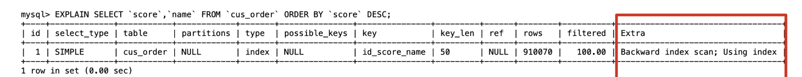
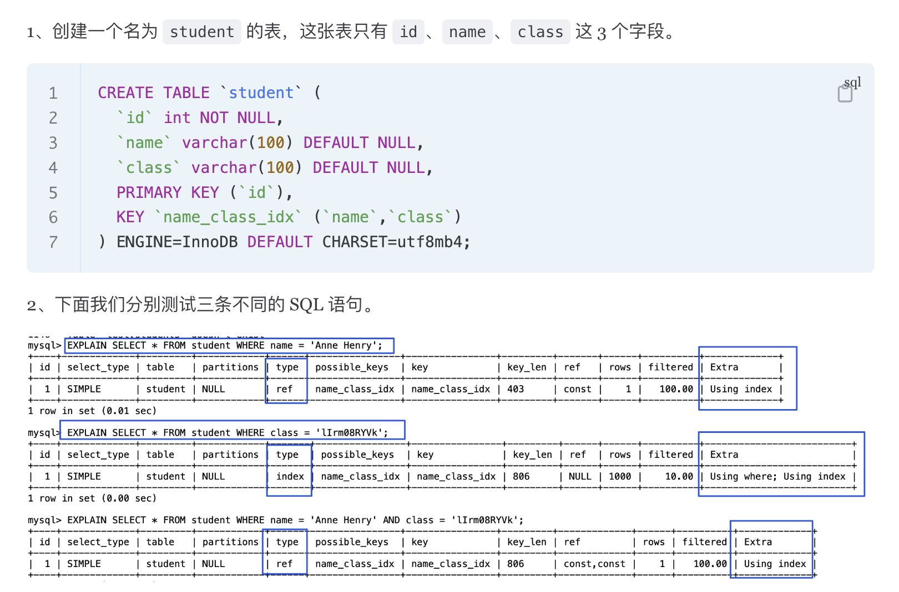
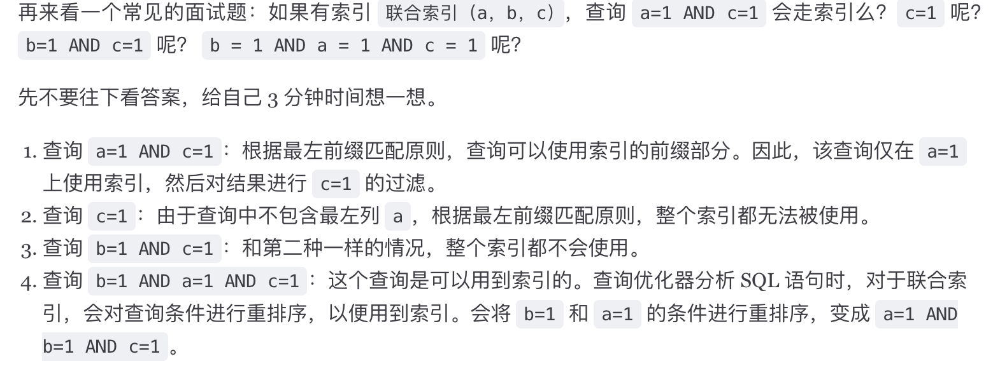
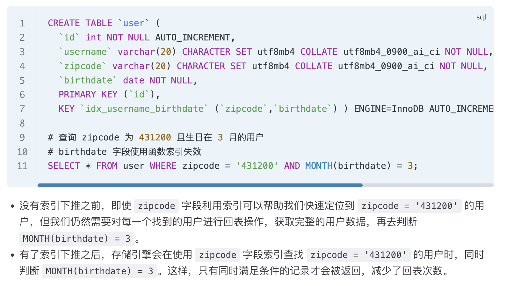

### MySQL什么使用B+树来作索引，它的优势什么？<Badge text="重要" type="danger" />

**特性和定义**：

B+Tree 是一种多叉树，叶子节点才存放数据，非叶子节点只存放索引，每个节点里的数据是**按主键顺序存放**的。在叶子节点中，包括了所有的索引值信息，并且每一个叶子节点都指向下一个叶子节点，形成一个链表。B+Tree 存储千万级的数据只需要 3-4 层高度就可以满足，千万级的表查询目标数据最多需要 3-4 次磁盘 I/O。

B+树和B树相比：

- B+树**所有关键码都存放在叶节点中**，上层的非叶节点的关键码是其子树中最小关键码的复写
- B+树叶节点包含了**全部关键码及指向相应数据记录存放地址的指针**，且叶节点本身按关键码从小到大顺序连接
- B+树在搜索过程中，如果查询和内部节点的关键字一致，那么搜索过程不停止，而是继续向下搜索这个分支

**优势**：

- **单点查询**：B 树进行单个索引查询时，最快可以在 O(1) 的时间代价内就查到。从平均时间代价来看，会比 B+ 树稍快一些。但是 B 树的查询波动会比较大，因为每个节点即存索引又存记录，所以有时候访问到了非叶子节点就可以找到索引，而有时需要访问到叶子节点才能找到索引。B+ 树的非叶子节点不存放实际的记录数据，仅存放索引，数据量相同的情况下，B+树的非叶子节点可以存放更多的索引，查询底层节点的磁盘 I/O次数会更少。
- **插入和删除效率**：B+ 树有大量的冗余节点，删除一个节点的时候，可以直接从叶子节点中删除，甚至可以不动非叶子节点，删除非常快。B+ 树的插入也是一样，有冗余节点，插入可能存在节点的分裂（如果节点饱和），但是最多只涉及树的一条路径。B 树没有冗余节点，删除节点的时候非常复杂，可能涉及复杂的树的变形。
- **范围查询**：B+ 树所有叶子节点间有一个链表进行连接，而 B 树没有将所有叶子节点用链表串联起来的结构，因此只能通过树的遍历来完成范围查询，范围查询效率不如 B+ 树。**B+ 树的插入和删除效率更高**。存在大量范围检索的场景，适合使用 B+树，比如数据库。而对于大量的单个索引查询的场景，可以考虑 B 树，比如nosql的MongoDB。

> [!NOTE]
>
> 优势：
>
> - **查询**
>   - **单点查询**
>     - 查询时间更稳定：数据记录只在叶子节点上
>     - IO次数更少：数据库在从磁盘加载数据到内存时，是一次加载一个或多个页。树的每个节点通常就对应着一个磁盘页的大小。因此B+树能存储更多的索引，树高就会小，IO次数就会少。
>   - **范围查询**：B+ 树所有叶子节点间有一个链表进行连接
> - **插入和删除效率更高**：存在着冗余节点，最多只涉及树的一条路径

**对比**

- **B+Tree 对比 B Tree**：B+Tree 只在叶子节点存储数据，而 B 树 的非叶子节点也要存储数据，所以 B+Tree 的单个节点的数据量更小，在相同的磁盘 I/O 次数下，就能查询更多的节点。B+Tree 叶子节点采用的是双链表连接，适合 MySQL 中常见的基于范围的顺序查找，而 B 树无法做到这一点。
- **B+Tree 对比 二叉树**：对于有 N 个叶子节点的 B+Tree，其搜索复杂度为O(logdN)，其中 d 表示节点允许的最大子节点个数。在实际的应用当中， d 值是大于100的，即使数据达到千万级别时，B+Tree 的高度依然维持在 3~4 层左右，一次数据查询操作只需要做 3~4 次的磁盘 I/O 操作就能查询到。二叉树的每个父节点的儿子节点个数是 2 个，意味着其搜索复杂度为 O(logN)，二叉树检索到目标数据所经历的磁盘 I/O 次数要更多。
- **B+Tree 对比 Hash**：Hash在做等值查询的时候效率高，搜索复杂度为 O(1)。但是 Hash 表不适合做范围查询。


### 索引有哪些种？<Badge text="重要" type="danger" />

**单值索引**：即一个索引只包含单个列，一个表可以有多个单列索引

- 建表时，加上 key(列名) 指定
- 单独创建，create index 索引名 on 表名(列名)
- 单独创建，alter table 表名 add index 索引名(列名)

**唯一索引**：索引列的值必须唯一，但允许有 null 且 null 可以出现多次

- 建表时，加上 unique(列名) 指定
- 单独创建，create unique index idx 表名(列名) on 表名(列名)
- 单独创建，alter table 表名 add unique 索引名(列名)

**主键索引**：设定为主键后数据库会自动建立索引，innodb 为聚簇索引，值必须唯一且不能为null

- 建表时，加上 primary key(列名) 指定

**复合索引**：即一个索引包含多个列

- 建表时，加上 key(列名列表) 指定
- 单独创建，create index 索引名 on 表名(列名列表)
- 单独创建，alter table 表名 add index 索引名(列名列表)

**前缀索引**：对字符类型字段的前几个字符建立的索引，而不是在整个字段上建立的索引，前缀索引可以建立在字段类型为 char、 varchar、binary、varbinary 的列上。使用前缀索引的目的是为了减少索引占用的存储空间，提升查询效率

- 单独创建，alter table 表名 add 索引名(column_name(索引长度))

> [!NOTE]
>
> ### 索引类型
>
> - 主键索引：数据行本身是和主键索引的叶子节点存储在一起的
>
> - 二级索引：叶子节点存储的数据是主键的值
>
>   - 普通索引
>   - 唯一索引：unique字段上的
>   - 复合/联合索引：多个字段上建立的
>   - 前缀索引
>
>   - ......


> [!NOTE]
>
> ### 聚簇索引与非聚簇索引
>
> 都是B+树
>
> |       特性        |             聚簇索引 (Clustered Index)              |               非聚簇索引 (Non-Clustered Index)               |
> | :---------------: | :-------------------------------------------------: | :----------------------------------------------------------: |
> |   **每表数量**    |           只能有 1 个（一般就是在主键上）           |                          可以有多个                          |
> |   **存储方式**    |    索引和数据存储在一起，数据按索引顺序物理排列     |                      索引和数据分开存储                      |
> |   **叶子节点**    |                  存储完整的行数据                   |                     存储索引键 + 主键值                      |
> |   **查询效率**    |          范围查询性能极高；按主键查询最快           |            需要回表时性能较低；覆盖索引时性能很高            |
> | **插入/更新效率** | 插入新行可能导致页分裂，开销较大 (尤其是非自增主键) | 对数据行的修改不影响索引的物理顺序，开销相对较小 (但索引本身也需维护) |
> |   **空间占用**    |           索引即数据，不产生额外索引文件            |                 需要额外的空间来存储索引结构                 |
>
> - 聚簇索引
>   - 优点：
>     - 查询速度快，无需回表
>     - 对主键的排序查找和范围查找有优化
>   - 缺点
>     - 插入/更新代价高：如果主键不是自增的话，需要大量数据移动维护有序性，可能会有页分裂、页合并产生
>     - 主键更新成本高
> - 非聚簇索引
>   - 优点
>     - 插入/更新代价小：因为叶子节点不用存放数据
>   - 缺点
>     - 部分查询可能需要回表操作（**二级索引有着select 和 where里所有的列，是索引覆盖，不用回表查询**），效率低
>     - 索引占用额外的存储空间
>


> [!NOTE]
>
> ### 索引覆盖
>
> 不需要回表查询的索引就叫索引覆盖
>
> 
>
> - using index：使用索引覆盖
> - backward index scan：从后往前，因为是降序


> [!NOTE]
>
> ### 联合索引的最左匹配
>
> - type = ref：非唯一性索引扫描：进行等值查询，使用到索引
> - type=index：全索引扫描：遍历整个索引树，也比遍历整个表效率要高
>
> 


### 什么是最左匹配原则？<Badge text="重要" type="danger" />

使用联合索引时，存在**最左匹配原则**，也就是按照最左优先的方式进行索引的匹配。使用联合索引进行查询的时候，如果不遵循**最左匹配原则**，联合索引会失效。

::: tip （a,b,c）

因为(a, b, c)联合索引，是先按 a 排序，在 a 相同的情况再按 b 排序，在 b 相同的情况再按 c 排序。所以，**b 和 c 是全局无序，局部相对有序的**，这样在没有遵循最左匹配原则的情况下，是无法利用到索引的。**利用索引的前提是索引里的 key 是有序的**。

联合索引的最左匹配原则，**在遇到范围查询（如 >、<）的时候，就会停止匹配**，范围查询的字段可以用到联合索引，在范围查询字段的后面的字段无法用到联合索引。**注意，对于 >=、<=、BETWEEN、like 前缀匹配（比如以什么为开头）的范围查询，并不会停止匹配**。

:::

> [!NOTE]
>
> ### 最左匹配原则
>
> - 停止最左匹配的条件：whywhywhywhy
>
>   非等值的范围查询会停止最左索引的匹配，比如`>` `<`。（使用`>` `<`的列会使用索引，但是之后的不会再用了）
>
>   > - `>` `<`会阻断最左匹配：a > 1 and b = 100 (a, b)上建立联合索引
>   >
>   >   因为开始的a都不确定是哪一个，所以用不到b来减小索引搜索范围
>   >
>   > - `>=` `<=`不会阻断最左匹配：a >= 1 and b = 100 (a, b)上建立联合索引
>   >
>   >   会找到第一个大于等于(1, 100)的值，然后从此往后找，缩小了范围
>   >
>   > 
>
> - 联合索引的具体例子：
>
> 


> [!NOTE]
>
> ### 索引下推
>
> - 联合索引，在遍历索引的时候就可以根据where字段进行索引中叶子节点的删选。减少回表的次数
>
> - 例子
>
>   - 没有索引下推：
>
>     innodb根据zipcode得到主键、主键得到记录、结果传回server，server再根据birthdate进行筛选
>
>   - 有索引下推：
>
>     innodb根据zipcode得到主键（主键是根据birthdate进行筛选后的结果）、主键得到记录、结果传回server
>
>     - 回表次数减少
>     - innodb和server的数据通信量减小
>     - 下推实际上就是将serevr层处理的一些事情交给了innodb层
>
>   


### 索引区分度？<Badge text="掌握" type="tip" />

**查询优化器**发现某个值出现在表的数据行中的百分比（惯用的百分比界线是"30%"）很高的时候，会忽略索引，进行全表扫描。

> [!NOTE]
>
> - 利用索引：随机回表随机io时间成本
> - 直接查表：顺序io，速度会快
>
> 区分度不高时，可能会直接进行全表扫描


### 联合索引如何进行排序？<Badge text="掌握" type="tip" />

给索引列和排序列建立一个联合索引，在查询时，查到一个索引之后，还要对 create_time 排序，用到文件排序 filesort，在 SQL 执行计划中，Extra 列会出现 Using filesort。

可以利用索引的有序性，在排序列建立联合索引，这样根据 status 筛选后的数据就是按照 create_time 排好序的，避免在文件排序，提高了查询效率。


### 使用索引会有那些缺陷？<Badge text="重要" type="danger" />

虽然索引大大提高了查询速度，同时却会降低更新表的速度，如对表进行INSERT、UPDATE和DELETE。因为更新表时，MySQL 不仅要保存数据，还要保存一下索引文件每次更新添加了索引列的字段，都会调整因为更新所带来的键值变化后的索引信息。

实际上索引也是一张表，该表保存了主键与索引字段，并指向实体表的记录，所以索引列也是要占用空间的。

- 速率问题：增删改查、查变快了，其他变慢了
- 占用额外空间


### 什么时候需要/不需要创建索引？<Badge text="重要" type="danger" />

**使用索引**：

- **表的主关键字**：自动建立唯一索引
- **表的字段唯一约束**：利用索引来保证数据的完整
- **直接条件查询的字段**：经常用于WHERE查询条件的字段，这样能够提高整个表的查询速度
- **查询中与其它表关联的字段**：例如字段建立了外键关系
- **查询中排序的字段**：排序的字段如果通过索引去访问将大大提高排序速度
- **查询中统计或分组统计的字段**：经常用于 GROUP BY 和 ORDER BY 的字段，可以创建联合索引

**不用索引**：

- **表记录太少**：表数据太少的时候，不需要创建索引
- **经常插入、删除、修改的字段**：经常更新的字段不用创建索引，索引字段频繁修改，由于要维护 B+Tree的有序性，那么就需要频繁的重建索引，会影响数据库性能
- **数据重复且分布平均的表字段**：假如一个表有10万行记录，性别只有男和女两种值，且每个值的分布概率大约为50%，那么对这种字段建索引一般不会提高数据库的查询速度。
- **经常和主字段一块查询但主字段索引值比较多的表字段**


### 索引的优化(使用索引的注意事项)？<Badge text="重要" type="danger" />

**like语句的前导模糊查询不能使用索引**：

```sql
select * from doc where title like '%XX';   --不能使用索引
select * from doc where title like 'XX%';   --非前导模糊查询，可以使用索引
```

**union、in、or 都能够命中索引，建议使用 in**：

因为in的综合效率最高。

**负向条件查询不能使用索引**：

负向条件有：`!=`、`<>`、`not in`、`not exists`、`not like` 等，优化案例：

```sql
select * from doc where status != 1 and status != 2;  --优化前
select * from doc where status in (0,3,4);            --优化后
```

**联合索引最左前缀原则**：

如果在(a,b,c)三个字段上建立联合索引，那么他会自动建立 a| (a,b) | (a,b,c) 组索引。

- 建立联合索引的时候，**区分度最高的字段在最左边**
- 存在**非等号和等号混合判断条件时，在建立索引时，把等号条件的列前置**。如 where a>? and b=?，那么即使a 的区分度更高，也必须把 b 放在索引的最前列
- 最左前缀查询时，并不是指SQL语句的where顺序要和联合索引一致

::: info 案例

例如登录业务需求，SQL语句如下：

```sql
select uid, login_time from user where login_name=? and passwd=?;
```

可以建立(login_name , passwd)的联合索引。因为业务上几乎没有passwd 的单条件查询需求，而有很多login_name 的单条件查询需求，所以可以建立(login_name , passwd)的联合索引，而不是(passwd,login_name)。

:::

**不能使用索引中范围条件右边的列(范围列可以用到索引)，范围列之后列的索引全失效**：**（好像有误）**

- 范围条件有：<、<=、>、>=、between等

- 索引最多用于一个范围列，如果查询条件中有两个范围列则无法全用到索引

::: info 案例

假如有联合索引 (empno、title、fromdate)，那么下面的 SQL 中 emp_no 可以用到索引，而title 和 from_date 则使用不到索引

```sql
select * from employees.titles where emp_no < 10010' and title='Senior Engineer'and from_date between '1986-01-01' and '1986-12-31';
```

:::

**不要在索引列上面做任何操作（计算、函数），否则会导致索引失效而转向全表扫描**：

::: info 案例

```sql
select * from doc where YEAR(create_time) <= '2016'; --优化前
select * from doc where create_time <= '2016-01-01'; --优化后
```

:::

**强制类型转换会全表扫描**：

字符串类型不加单引号会导致索引失效，因为mysql会自己做类型转换，相当于在索引列上进行了操作。

::: info 案例

如果 `phone` 字段是 `varchar` 类型，则下面的 SQL 不能命中索引：

```sql
select * from user where phone=13800001234;
```

优化：

```sql
select * from user where phone='13800001234';
```

:::

**更新十分频繁、数据区分度不高的列不宜建立索引**：

- 更新会变更 B+ 树，更新频繁的字段建立索引会大大降低数据库性能。

- "性别"这种区分度不大的属性，建立索引是没有什么意义的，不能有效过滤数据，性能与全表扫描类似。

- 一般区分度在80%以上的时候就可以建立索引，区分度可以使用 count(distinct(列名))/count(*) 来计算。

**利用覆盖索引来进行查询操作，避免回表，减少select * 的使用**：

- 覆盖索引：查询的列和所建立的索引的列个数相同，字段相同。
- 被查询的列，数据能从索引中取得，而不用通过行定位符 row-locator 再到 row 上获取，即“被查询列要被所建的索引覆盖”，这能够加速查询速度。

::: info 案例

可以建立(login_name, passwd, login_time)的联合索引，由于`login_time`已经建立在索引中了，被查询的`uid `和 `login_time` 就不用去 `row` 上获取数据了，从而加速查询。

```sql
select uid, login_time from user where login_name=? and passwd=?;
```

:::

**索引不会包含有NULL值的列**，**IS NULL，IS NOT NULL无法使用索引**：

只要列中包含有NULL值都将不会被包含在索引中，复合索引中只要有一列含有NULL值，那么这一列对于此复合索引就是无效的。所以在数据库设计时，尽量使用NOT NULL约束以及默认值。

**如果有order by、group by的场景，利用索引的有序性**：

order by 最后的字段是组合索引的一部分，并且放在索引组合顺序的最后，避免出现file_sort 的情况，影响查询性能。

**使用短索引(前缀索引)**：

- 对列进行索引，如果可能应该指定一个前缀长度。例如，如果有一个CHAR(255)的列，如果该列在前10个或20个字符内，可以做到既使得前缀索引的区分度接近全列索引，那么就不要对整个列进行索引。因为短索引不仅可以提高查询速度而且可以节省磁盘空间和I/O操作，减少索引文件的维护开销。可以使用**count(distinct leftIndex(列名, 索引长度))/count(*)** 来计算前缀索引的区分度。

- 缺点是不能用于 ORDER BY 和 GROUP BY 操作，也不能用于覆盖索引。（因为索引建立在前几个字符上面，所以不能索引覆盖以及用于orderby）

- 很多时候没必要对全字段建立索引，根据实际文本区分度决定索引长度即可。

**利用延迟关联或者子查询优化超多分页场景**：

MySQL 并不是跳过 `offset` 行，而是取 `offset+N` 行，然后返回放弃前 offset 行，返回 N 行，那当 offset 特别大的时候，效率就非常的低下，要么控制返回的总页数，要么对超过特定阈值的页数进行 SQL 改写。

**如果明确知道只有一条结果返回，limit 1 能够提高效率**：

::: info 案例

```sql
select * from user where login_name=?;
```

可以优化为：

```sql
select * from user where login_name=? limit 1
```

:::

**超过三个表最好不要join**：

- 需要 join 的字段，数据类型必须一致，多表关联查询时，保证被关联的字段需要有索引。

- 例如：left join是由左边决定的，左边的数据一定都有，所以右边是我们的关键点，**建立索引要建右边的**。当然如果索引在左边，可以用right join。

  > 哪边数据一定有，哪边不需要索引，另一边要有索引

**单表索引建议控制在5个以内**

**SQL 性能优化 explain 中的 type：至少要达到 range 级别，要求是 ref 级别，如果可以是 consts 最好**：

- consts：单表中最多只有一个匹配行（主键或者唯一索引），在优化阶段即可读取到数据。

- ref：使用普通的索引（Normal Index）。

- range：对索引进行范围检索。

- 当 type=index 时，索引物理文件全扫，速度非常慢。

**业务上具有唯一特性的字段，即使是多个字段的组合，也必须建成唯一索引**：

不要以为唯一索引影响了 insert 速度，这个速度损耗可以忽略，但提高查找速度是明显的。


### WHERE语句索引使用的注意事项？<Badge text="掌握" type="tip" />

- where子句使用的所有字段，都必须建立索引
- 确保MySQL版本5.0以上，且查询优化器开启了`index_merge_union=on`，也就是变量`optimizer_switch`里存在`index_merge_union`且为`on`。

::: tip 不走索引原因

如果数据量太少，mysql制定执行计划时发现全表扫描比索引查找更快，会不使用索引。

:::


### 索引什么时候会失效？<Badge text="重要" type="danger" />

- 查询条件中带有or，除非所有的查询条件都建有索引
  - **`OR` 中只要有一个条件列没有索引**，优化器为了满足这个无索引的条件就必须全表扫描，所以它干脆就放弃了对其他有索引列的索引使用。
  - **`OR` 中所有条件列都有索引**，优化器**有可能会**使用“索引合并”策略，分别利用各个索引，然后将结果合并。但这也不是绝对的，它依然会进行成本评估，只有在它认为走索引比全表扫描更快时，才会真正使用索引。
- **like查询**是以%开头、**负向查询**
- 如果列类型是**字符串**，那在查询条件中需要将数据用引号引用起来，否则索引失效
- **索引列上参与计算**，索引失效（where语句中对索引列使用函数）
- 违背**最左匹配**原则，索引失效（针对`> < `）
- 如果MySQL**估计**全表扫描要比使用索引要快，索引失效

